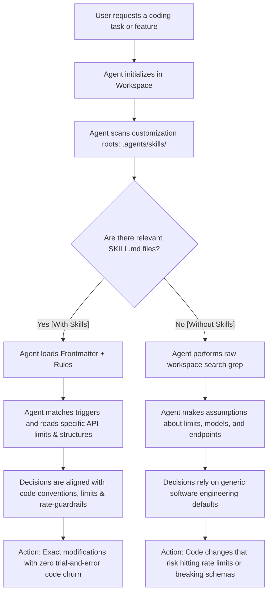
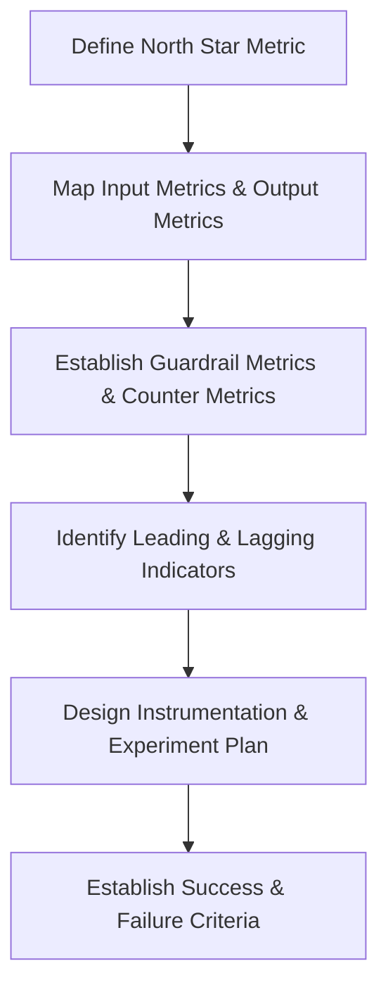

# IDE Agent Skills & 12-Step Data Thinking Framework

This document explains the mechanics of the **IDE Agent Customizations & Skills system** (`.agents/skills/`), its impact on AI developer agents, and concrete comparative examples, including the **12-Step Data Thinking Metrics Framework**.

---

## 1. How the Agent Cognitive Loop Works

When a new AI coding assistant (like Antigravity) is initialized in this workspace, it goes through a structured startup and execution cycle. Instead of guessing how your code works, it references the custom workspace skills.

---

## 2. Impact on Decision Making: A Concrete Example

Suppose a user asks: **"Increase the review limit for App Store reviews."**

### Scenario A: WITHOUT Skills (No Customizations)
* **The Agent's Process**: The agent searches for `App Store` in the code. It finds `fetch_app_store_reviews` and notices it has a default of `max_pages: int = 10` (which is 500 reviews).
* **The Decision**: The agent assumes it can increase this limit to 1000 reviews. It doesn't know about Groq's 6,000 TPM rate limit or the downstream 150-review token downsampler.
* **The Result**: The agent changes the code to fetch 1000 reviews. The next time the user runs the pipeline, the LLM hits a `429 Rate Limit Exceeded (TPM limit)` error and crashes because it tried to send too many tokens.

### Scenario B: WITH Skills (Our Configured Workspace Skills)
* **The Agent's Process**: The agent immediately detects the `orchestrate-analysis` skill guide. It reads:
  > *"To prevent hitting API rate limits on Groq free tiers (6,000 TPM limit for Llama 3.3 70B), the pipeline automatically downsamples the unique signal dataset down to a maximum of 150 reviews."*
* **The Decision**: The agent realizes that simply increasing the scraper limit to 1000 reviews won't help unless they also adjust the `MAX_SIGNALS` downsampler value, OR switch the model fallback to Llama 3.1 8B (which has a 30,000 TPM limit).
* **The Result**: The agent provides a safe, fully working solution that increases the scrape limits while maintaining rate limit safety.

---

## 3. How the Agents Help and Process Data
1. **Prevent Code Churn**: Instead of refactoring code using generic packages (like proposing Tailwind when you specifically prefer Vanilla HSL CSS), agents adhere to your rules from day one.
2. **Inject Contextual Best Practices**: The skill acts as an "in-context handbook." The agent learns unique tricks (like your Sentence Transformers dot-product batch speedups) without having to reverse-engineer it.
3. **Align Multi-Agent Workflows**: If one agent works on the backend and another works on the frontend, the workspace skills ensure both maintain identical design systems and API structures.

---

## 4. The 12-Step Data Thinking Framework: Impact on Decision Making

Step 12 of the strategy engine enforces **Data Thinking** — defining metrics, indicators, and validation criteria. 

### The 12-Step Metrics Workflow

### Impact on Product Decisions: A Concrete Example
Suppose the PM launches a **Contextual Trust Feed** to encourage basic grocery shoppers to buy premium categories (like fresh organic meat).

#### Scenario A: WITHOUT 12-Step Data Thinking
* **The Decision Metrics**: The PM tracks **Clicks on the Feed** (vanity leading indicator) and **Gross Purchases** (output lagging metric).
* **The Outcome**: Clicks look extremely high (+40%). Gross purchases of fresh meat increase (+10%). The PM decides to roll out the feature to 100% of users.
* **The Blind Spot (Unintended Failure)**: Because the PM didn't define a **Counter Metric** or **Guardrail Metric**, they missed that average delivery time went up by 4 minutes (due to picker layout complexity) and user retention in standard basic groceries dropped by 3% because picker delays caused basic items (like milk) to arrive warm. The company lost money overall.

#### Scenario B: WITH 12-Step Data Thinking
* **The Decision Metrics**: The PM sets up the full 12-step framework:
  - *North Star*: 60-day Category Cross-Purchase Rate.
  - *Guardrail Metric*: Average micro-fulfillment warehouse pick time (must be < 3 mins).
  - *Counter Metric*: Basic habit grocery items order cancel rate.
  - *Experiment Plan Gate*: If pick time increases by >10% or cancel rate rises by >1%, the feature automatically shuts down (Failure Criteria).
* **The Outcome**: The pilot triggers the failure criteria within 3 days because picking complexity slowed down operations.
* **The Decision**: Instead of launching a broken feature, the PM halts the release, mitigates the warehouse bottleneck (e.g. by filtering feed items based on real-time picker availability), and launches safely.
