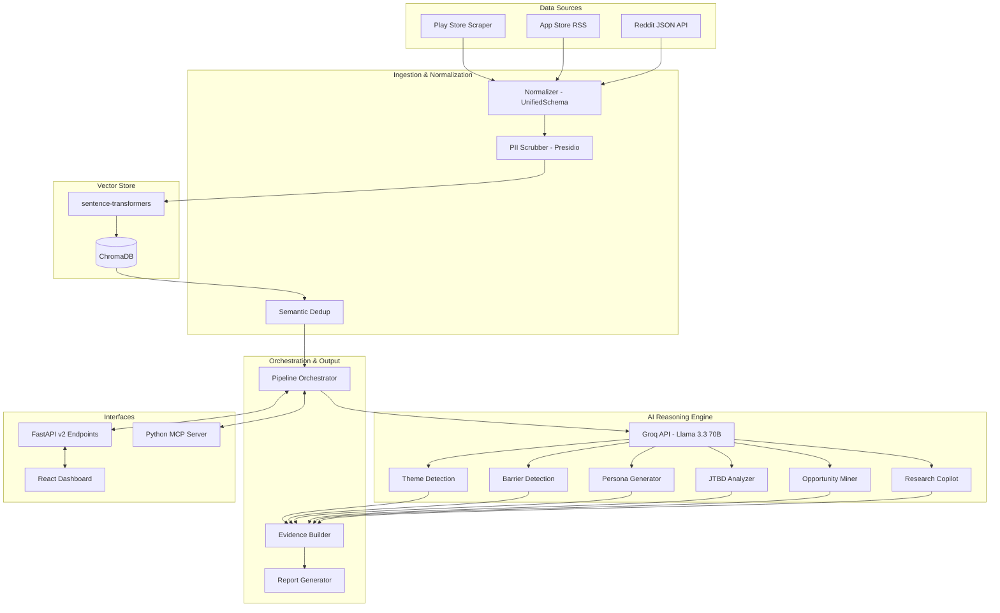

# Pulse Intelligence — Architecture Document

## High-Level Architecture

The system is a modular **Consumer Intelligence Platform** separated into Data Collection, Normalization & Storage, AI Reasoning, and Output layers.

## Core Components

### 1. Ingestion & Normalization (`backend/ingestion/`)
- **Multi-Source Fetchers**: Play Store (`google-play-scraper`), App Store (iTunes RSS), and Reddit (Public JSON API with recursive comment extraction).
- **Normalizer**: Converts raw data into a `UnifiedSignal` schema. Contains keyword-based detectors for product categories (e.g., Grocery, Beauty) and behavioral signals (e.g., `habit_loop`, `trust_issue`).

### 2. Processing & Storage (`backend/processing/`, `backend/core/`)
- **Vector Store (`core/vector_store.py`)**: Uses `ChromaDB` for storage and similarity search. Lazy-loads the `sentence-transformers` (`all-MiniLM-L6-v2`) model to generate 384-dimensional embeddings.
- **Semantic Deduplication (`processing/deduplication.py`)**: Identifies and removes duplicate or heavily overlapping signals across sources using vector similarity.
- **PII Scrubbing (`processing/pii_scrubber.py`)**: Uses Microsoft Presidio and spaCy to redact names, emails, and phone numbers before data reaches the LLM.

### 3. AI Reasoning Engine (`backend/reasoning/`)
Powered by Groq's Llama 3.3 70B model, orchestrated by `core/llm_client.py` (which handles rate limiting, model selection, and retries).
- **Behavior Analyzer**: Extracts themes and category exploration barriers (e.g., Awareness, Trust, Habit, Price).
- **Persona Generator**: Creates behavioral user archetypes with habits, motivations, and category preferences.
- **JTBD Analyzer**: Extracts Functional, Emotional, and Social Jobs-To-Be-Done with opportunity scoring.
- **Opportunity Miner**: Synthesizes themes, barriers, and JTBD into prioritized product opportunities.
- **Research Copilot**: Generates testable hypotheses and "Mom Test" interview questions.

### 4. Output & Orchestration (`backend/output/`, `backend/agents/`)
- **Evidence Builder**: Ties every AI insight back to verbatim user quotes, generating a confidence score based on mention count, source diversity, and contradiction ratio.
- **Report Generator**: Creates executive summaries and specialized Category Discovery Reports.
- **Pipeline Orchestrator (`agents/orchestrator.py`)**: The central "manager" agent that coordinates the flow from data collection through all reasoning steps to the final report, providing progress tracking and state management.

### 5. Interfaces (`backend/main.py`, `backend/mcp_server.py`)
- **FastAPI**: Provides `/api/v2/*` endpoints for running the pipeline, fetching analysis results, and semantic search. Original v1 endpoints are preserved.
- **MCP Server**: A native Python MCP server exposing 15+ tools for Claude Desktop or Cursor to directly interact with the intelligence platform.
- **React Dashboard**: The Vite-based frontend (Phase 8) visualizes the insights, personas, and category barriers.
