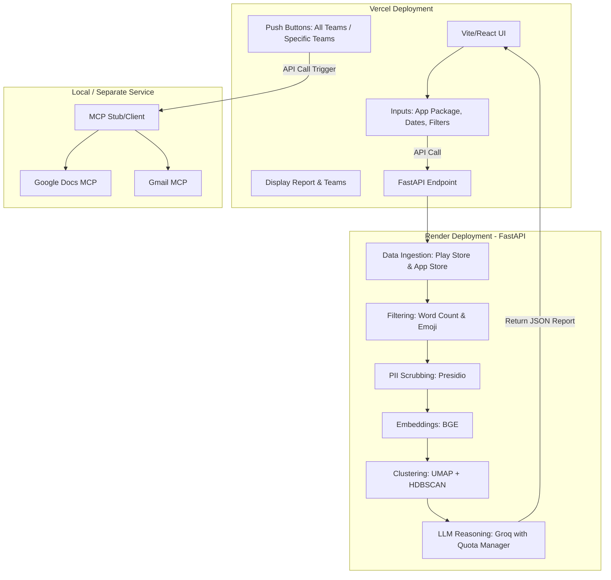

# Weekly Product Review Pulse — Architecture Document

## High-Level Architecture
The system is divided into a **Frontend (UI)** and a **Backend (Data Pipeline & Orchestration)**, separated by a REST API.

## Components Breakdown

### 1. Frontend (Vite)
* **Hosting**: Vercel
* **Purpose**: User interaction, input gathering, and report visualization.
* **Features**:
  * Date range selector.
  * Inputs for App Store ID and Play Store Package Name.
  * Sliders/Toggles for minimum word count and emoji inclusion.
  * Report Dashboard to view the final generated pulse grouped by **Team Category** (Product, Engineering, Art, CEO).
  * Manual Push buttons (Global and Team-Specific) to trigger the MCP workflow.

### 2. Backend (FastAPI + Python Data Pipeline)
* **Hosting**: Render
* **Purpose**: Data retrieval and LLM reasoning.
* **Modules**:
  * **`ingestion/`**: Scrapes reviews from Apple App Store (RSS) and Google Play (`google-play-scraper`).
  * **`processing/`**: 
    * Filters reviews based on UI parameters.
    * Scrubs PII using Microsoft Presidio.
    * Generates embeddings using `BAAI/bge-small-en-v1.5`.
    * Clusters reviews using UMAP and HDBSCAN to find centroids.
  * **`reasoning/`**: Uses Groq LLM API to analyze centroid reviews, extract themes, select verbatim quotes (with strict substring validation), and categorize themes by Team. **Includes a Quota Manager** that strictly tracks Tokens Per Minute (TPM) and Requests Per Minute (RPM) using chunking and programmatic delays to prevent rate limit violations.
  * **`output/`**: Formats the reasoning into structured JSON sent back to the Frontend.

### 3. MCP Clients (Output Delivery)
* **Purpose**: Writes to Google Workspace without embedding OAuth tokens directly in the agent.
* **Flow**: 
  * Triggered manually from the Frontend.
  * Takes the structured JSON report and uses the `mcp_client_stub` to mock sending updates to Google Docs and Gmail.
