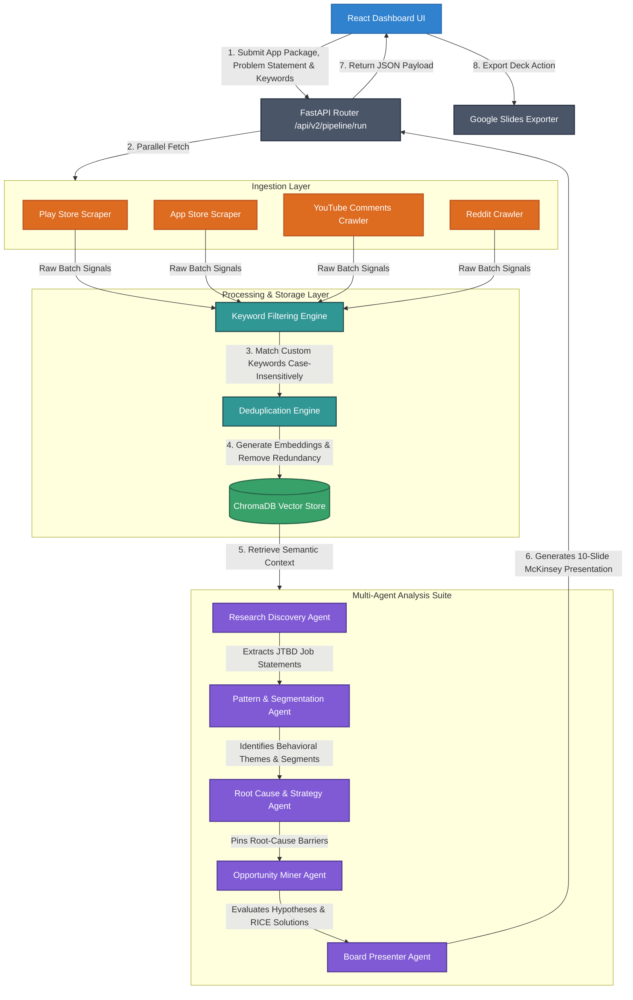

# Technical System Data Flow Diagram

Below is the complete technical data flow mapping the ingestion, filtering, multi-agent analysis, and executive presentation generation stages.

```mermaid
graph TD
    %% Styling Nodes
    classDef frontend fill:#3182ce,stroke:#2b6cb0,stroke-width:2px,color:#fff;
    classDef api fill:#4a5568,stroke:#2d3748,stroke-width:2px,color:#fff;
    classDef ingest fill:#dd6b20,stroke:#c05621,stroke-width:2px,color:#fff;
    classDef process fill:#319795,stroke:#234e52,stroke-width:2px,color:#fff;
    classDef agent fill:#805ad5,stroke:#553c9a,stroke-width:2px,color:#fff;
    classDef db fill:#38a169,stroke:#276749,stroke-width:2px,color:#fff;

    %% Elements
    UI[React Dashboard UI]:::frontend
    API[FastAPI Router /api/v2/pipeline/run]:::api
    
    subgraph Ingestion_Layer [Ingestion Layer]
        PS[Play Store Scraper]:::ingest
        AS[App Store Scraper]:::ingest
        YT[YouTube Comments Crawler]:::ingest
        RD[Reddit Crawler]:::ingest
    end

    subgraph Processing_Layer [Processing & Storage Layer]
        KWF[Keyword Filtering Engine]:::process
        DEDUP[Deduplication Engine]:::process
        CHROMA[(ChromaDB Vector Store)]:::db
    end

    subgraph Multi_Agent_Analysis [Multi-Agent Analysis Suite]
        DA[Research Discovery Agent]:::agent
        PSA[Pattern & Segmentation Agent]:::agent
        RCSA[Root Cause & Strategy Agent]:::agent
        OMA[Opportunity Miner Agent]:::agent
        BP[Board Presenter Agent]:::agent
    end

    EXPORT[Google Slides Exporter]:::api

    %% Flows
    UI -->|1. Submit App Package, Problem Statement & Keywords| API
    API -->|2. Parallel Fetch| Ingestion_Layer
    
    PS -->|Raw Batch Signals| KWF
    AS -->|Raw Batch Signals| KWF
    YT -->|Raw Batch Signals| KWF
    RD -->|Raw Batch Signals| KWF
    
    KWF -->|3. Match Custom Keywords Case-Insensitively| DEDUP
    DEDUP -->|4. Generate Embeddings & Remove Redundancy| CHROMA
    
    CHROMA -->|5. Retrieve Semantic Context| Multi_Agent_Analysis
    
    DA -->|Extracts JTBD Job Statements| PSA
    PSA -->|Identifies Behavioral Themes & Segments| RCSA
    RCSA -->|Pins Root-Cause Barriers| OMA
    OMA -->|Evaluates Hypotheses & RICE Solutions| BP
    
    BP -->|6. Generates 10-Slide McKinsey Presentation| API
    API -->|7. Return JSON Payload| UI
    UI -->|8. Export Deck Action| EXPORT
```
