# Technical System Data Flow Diagram

Below is the complete technical architecture and data flow mapping the ingestion, dynamic filtering, multi-agent AI strategy research, and executive presentation generation stages.

```mermaid
flowchart TD
    %% Styling Configuration
    classDef frontend fill:#1e1e2e,stroke:#f97316,stroke-width:2px,color:#fff;
    classDef api fill:#1e1e2e,stroke:#3b82f6,stroke-width:2px,color:#fff;
    classDef ingest fill:#1e1e2e,stroke:#06b6d4,stroke-width:2px,color:#fff;
    classDef process fill:#1e1e2e,stroke:#10b981,stroke-width:2px,color:#fff;
    classDef agent fill:#1e1e2e,stroke:#8b5cf6,stroke-width:2px,color:#fff;
    classDef output fill:#1e1e2e,stroke:#ec4899,stroke-width:2px,color:#fff;

    %% 1. FRONTEND USER CONTROLS
    subgraph S1["1. User Configuration & Ingestion Trigger"]
        UI["React Dashboard UI<br/><i>(Controls & Prompt Input)</i>"]:::frontend
        PARAMS["Parameters: Target App, Problem Statement,<br/>Dynamic Keywords & Date Range"]:::frontend
    end

    %% 2. BACKEND API ROUTER
    subgraph S2["2. API Orchestration Layer"]
        API["FastAPI Engine<br/><code>POST /api/v2/pipeline/run</code>"]:::api
        ORCH["Pipeline Orchestrator<br/><i>(Asynchronous Background Task)</i>"]:::api
    end

    %% 3. MULTI-SOURCE INGESTION WITH IN-SCRAPER FILTERING
    subgraph S3["3. Targeted Multi-Platform Ingestion Layer"]
        PS["Google Play Store Scraper<br/><i>(Continuation Token Pagination up to 6,000 reviews)</i>"]:::ingest
        AS["Apple App Store Scraper<br/><i>(iTunes XML RSS Real-time Keyword Matching)</i>"]:::ingest
        YT["YouTube Comments Downloader<br/><i>(Keyword-Enriched Video Queries)</i>"]:::ingest
        RD["Reddit Discussions Crawler<br/><i>(Multi-Subreddit Keyword Search)</i>"]:::ingest
    end

    %% 4. NORMALIZATION & PRE-PROCESSING
    subgraph S4["4. Normalization & Local Semantic Pre-Filter"]
        DEDUP["Exact & Fuzzy Signal Deduplication"]:::process
        EMBED["Local MiniLM Vector Semantic Pre-Filter<br/><i>(Scores review cosine similarity vs Problem Statement)</i>"]:::process
        BAL["Dataset Source Balancer<br/><i>(Preserves Top Semantic Rankings)</i>"]:::process
        PII["PII Sanitizer & Text Scrubbing"]:::process
        SENT["VADER / Sentiment Classifier<br/><i>(Positive / Neutral / Negative)</i>"]:::process
    end

    %% 5. MULTI-AGENT STRATEGY RESEARCH PIPELINE
    subgraph S5["5. 5-Stage Multi-Agent AI Strategy Engine (Groq / Qwen 27B)"]
        A1["Stage 1: Research Planning Agent<br/><i>(Data quality audit & framework selection)</i>"]:::agent
        A2["Stage 2: Data Processing Agent<br/><i>(Statistical anomaly detection & cleanliness report)</i>"]:::agent
        A3["Stage 3: Research Discovery Agent<br/><i>(Behavioral patterns, verbatim quotes & JTBD statements)</i>"]:::agent
        A4["Stage 4: Pattern & Segmentation Agent<br/><i>(Natural User Personas & Prioritized Themes)</i>"]:::agent
        A5["Stage 5: Root Cause & Strategy Agent<br/><i>(Validated Category Barriers & Mitigation Specs)</i>"]:::agent
    end

    %% 6. PHASE 2 DEEP DIVE & EXECUTIVE SYNTHESIS
    subgraph S6["6. Executive Synthesis & Deliverables Engine"]
        SOL["Solution Generation Agent<br/><i>(RICE Scoring & Feature Alternatives)</i>"]:::agent
        DECK["Executive Presentation Agent<br/><i>(10-Slide McKinsey Narrative Arc)</i>"]:::agent
        CACHE[("Local Persistence Cache<br/><code>pipeline_cache.json</code><br/><code>strategy_cache.json</code>")]:::process
    end

    %% 7. DASHBOARD DELIVERABLES & EXPORTERS
    subgraph S7["7. User Deliverables & Interactive UI"]
        DASH["📊 Dashboard Overview<br/><i>(KPIs, Sentiment Distribution, Top Themes & Barriers)</i>"]:::output
        HUB["👥 Consumer Insights Hub<br/><i>(User Personas, Category Barriers, Growth Opps)</i>"]:::output
        SIGS["🗂️ Signals Database<br/><i>(Cleaned signals, sentiment tags, search filter)</i>"]:::output
        EXPD["📑 Google Docs Exporter<br/><i>(Full Strategy Deep Dive Document)</i>"]:::output
        EXPS["📽️ Google Slides Exporter<br/><i>(10-Slide McKinsey Programmatic Branded Deck)</i>"]:::output
    end

    %% Connectors
    UI --> PARAMS
    PARAMS --> API
    API --> ORCH

    ORCH -->|1. Dispatch Parallel Ingestion with Keywords| S3
    PS --> DEDUP
    AS --> DEDUP
    YT --> DEDUP
    RD --> DEDUP

    DEDUP --> EMBED
    EMBED --> BAL
    BAL --> PII
    PII --> SENT

    SENT -->|2. High-Signal Filtered Signals| A1
    A1 --> A2
    A2 --> A3
    A3 --> A4
    A4 --> A5

    A5 -->|3. Auto-Map Phase 1 Telemetry| CACHE
    A5 -->|4. Trigger Phase 2 Synthesis| SOL
    SOL --> DECK
    DECK --> CACHE

    CACHE -->|5. Real-time Telemetry & Endpoints| DASH
    CACHE --> HUB
    CACHE --> SIGS
    DECK --> EXPD
    DECK --> EXPS
```

---

### Key Technical Pipeline Highlights

1. **In-Scraper Keyword Harvesting**:
   - **Google Play Store**: Uses continuation tokens to page through up to 6,000 reviews without hitting boundaries or duplicate loops.
   - **App Store, YouTube & Reddit**: Runs keyword-targeted queries and captures relevant discussions directly at the source.

2. **Problem Statement Dominance & Local Semantic Pre-Filter**:
   - Uses `all-MiniLM-L6-v2` locally to score all ingested reviews against the user's active problem statement, keeping only top-ranked relevant reviews and bypassing expensive LLM filtering tokens.

3. **5-Stage Strategy Deep Dive (Phase 1)**:
   - **Research Planning Agent**: Selects analytical frameworks (*Issue Tree, User Journey, 5 Whys, JTBD*).
   - **Data Processing Agent**: Evaluates statistical distributions and identifies data anomalies.
   - **Research Discovery Agent**: Extracts behavioral friction patterns, anomalies, and authentic verbatim quotes.
   - **Pattern & Segmentation Agent**: Clusters reviews into natural **User Personas** and **Prioritized Themes**.
   - **Root Cause Agent**: Validates underlying cognitive and UX **Category Barriers** with mitigation recommendations.

4. **Phase 2 & Executive Presentation**:
   - Evaluates solution hypotheses using the RICE framework and formats a 10-slide McKinsey-style presentation exported directly to **Google Slides** and **Google Docs**.
